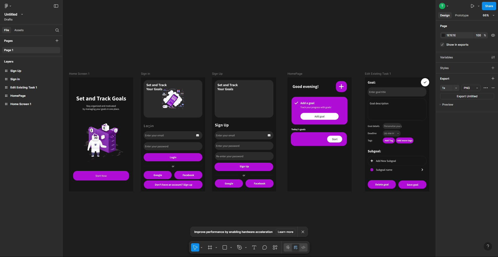
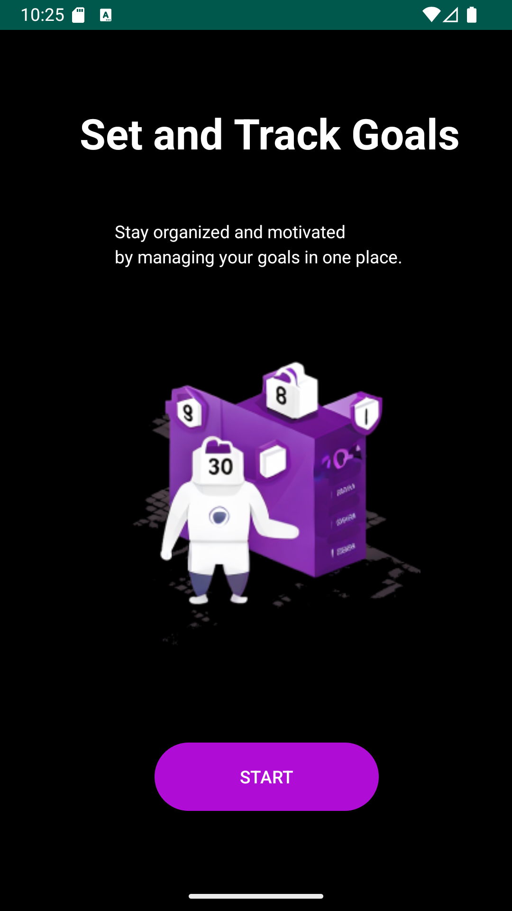
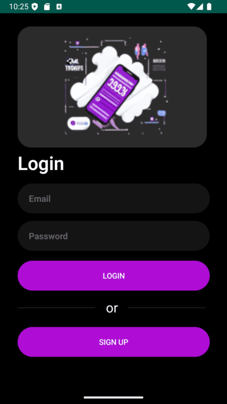
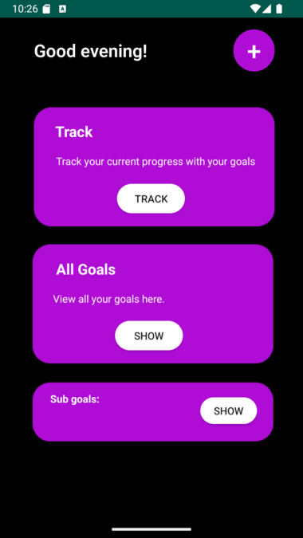
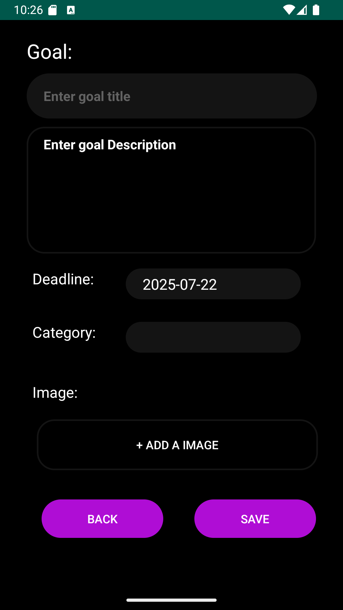
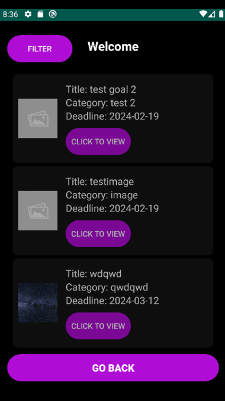

# Personalized Goal Tracker

**Personalized Goal Tracker** is a clean and efficient Android app designed to help users set, track, and accomplish their personal goals with ease. Developed in **Android Studio** using **Kotlin**, the app integrates **Firebase** services to ensure a smooth, secure, and responsive experience.

---

## 🚀 Features

### 🔹 Simple & Intuitive UI
A distraction-free interface focused solely on what matters—your goals. Easy to navigate and user-friendly for all experience levels.

### 🔹 Firebase Integration
- **Authentication**: Secure sign-in with Firebase Authentication ensures your data is protected and accessible only by you.
- **Realtime Database**: Track and manage goals in real time. Data is always synced and up to date.
- **Image Storage**: Upload images related to your goals. Images are stored in Firebase Storage and efficiently displayed using the Glide library.

### 🔹 Progress Visualization
Visualize your progress with clean and interactive charts powered by **MPAndroidChart**, keeping you motivated and on track.

### 🔹 Efficient Goal Management
Set clear objectives, break them into milestones, and track your progress live. The app intentionally avoids feature bloat to provide a focused, streamlined experience.

---

## 🎨 UI Planning

The app's user interface was carefully planned and prototyped in **Figma** before development began. This helped ensure a clean layout and smooth user experience.

### Figma Design


---

## 📱 Screenshots

### Screenshot 1


### Screenshot 2


### Screenshot 3


### Screenshot 4


### Screenshot 5


### Screenshot 6


---

## 🛠 Tech Stack

- **Kotlin** (Android development)
- **Firebase** (Authentication, Realtime Database, Storage)
- **Glide** (Image loading)
- **MPAndroidChart** (Progress charts)

---

## 📌 Use Cases

- Building daily habits  
- Tracking personal or professional goals  
- Monitoring project milestones  
- Staying motivated with visual feedback

---

## 📥 Installation

1. Clone the repository:  
   ```bash
   git clone https://github.com/your-username/personalized-goal-tracker.git
   ```
2. Open in Android Studio.
3. Connect your Firebase project and configure `google-services.json`.
4. Build and run on your device or emulator.